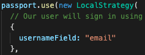
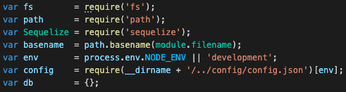
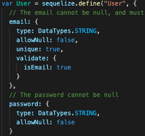
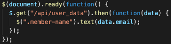
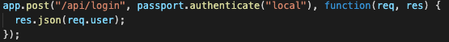
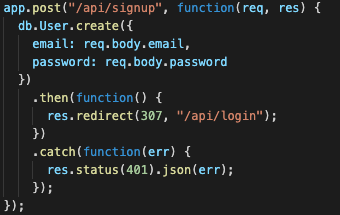
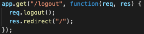

# Reverse-Engineer-Code
When joining a new team, you will be expected to inspect a lot of code that you have never seen before. Rather than having a team member explain every line for you, you will dissect the code by yourself, saving any questions for a member of your team.

## Table of Contents
  * [Description](#Description)
  * [TableOfContents](#TableOfContents)
  * [Walkthrough](#Walkthrough)
  * [License](#license)
  * [Contributors](#Contributors)

## Written Tutorials
#### isAuthenticated.js  
- This is a middleware that restricts users if not logged in and redirects the user to the login page. On the other hand If the user is logged in then it redirects them to members page. 

#### config.json
- lists of credentials needed for connecting to the database.

#### passport.js
- Exports:  "passport"
- This file is used to authenticate login information with email and password. It also looks into the database if information already exists. It also checks for a correct input.
    

#### index.js
- Exports:  "db"
- Gathers all the files in the models folder to be used to import to another file. 
     

#### user.js
- Requires:  "bcrypt"
- Sets params for input and creates user models. Also encryps the password.
     

#### login.js
- Validates the email and password input when the form is submitted. If email and password is valid, it directs the user to members page. If not then it clears the form and redirects back to the login page.

#### members.js
- looks for the user's credentials and updates the user info after login.
    

#### signup.js
- Allows user to create new login and if successful, it gathers user information and redirects to members page.

#### style.css
- Sets the margin-top to 50px for the signup and login forms

#### login.html, members.html, signup.html
- For login.html it contains a form for email and password input. also contains a link to the signup page and a login button.
- For members.html, contains a page that welcomes members and logout button. 
- For signup.html, contains a form  for email and password, a link to the login page and a signup button.
    
#### api-routes.js
- Requires:  "db", "passport"
- Post requests for user login functions, 

    
-  Post requests for signup functions, and 
    
    
- Get requests for logout functions. 
    
    

#### html-routes.js
- Requires:  "path"
- Routes to the html files and middleware to check if user is logged in, if not redirects the user to the login/sign up page.

#### package.json
- List of npm dependencies.

#### server.js
- Requires:  "express", "express-session", "passport", "db"
- Configures the ports and user credentials. Also used to track the status of the user
  
## License
 
Copyright (c) 2020 Biencarlo Villa

Permission is hereby granted, free of charge, to any person obtaining a copy of this software and associated documentation files (the "Software"), to deal in the Software without restriction, including without limitation the rights to use, copy, modify, merge, publish, distribute, sublicense, and/or sell copies of the Software, and to permit persons to whom the Software is furnished to do so, subject to the following conditions:

The above copyright notice and this permission notice shall be included in all copies or substantial portions of the Software.

THE SOFTWARE IS PROVIDED "AS IS", WITHOUT WARRANTY OF ANY KIND, EXPRESS OR IMPLIED, INCLUDING BUT NOT LIMITED TO THE WARRANTIES OF MERCHANTABILITY, FITNESS FOR A PARTICULAR PURPOSE AND NONINFRINGEMENT. IN NO EVENT SHALL THE AUTHORS OR COPYRIGHT HOLDERS BE LIABLE FOR ANY CLAIM, DAMAGES OR OTHER LIABILITY, WHETHER IN AN ACTION OF CONTRACT, TORT OR OTHERWISE, ARISING FROM, OUT OF OR IN CONNECTION WITH THE SOFTWARE OR THE USE OR OTHER DEALINGS IN THE SOFTWARE.
  
  ## Contributors
   https://github.com/biencarlovilla
